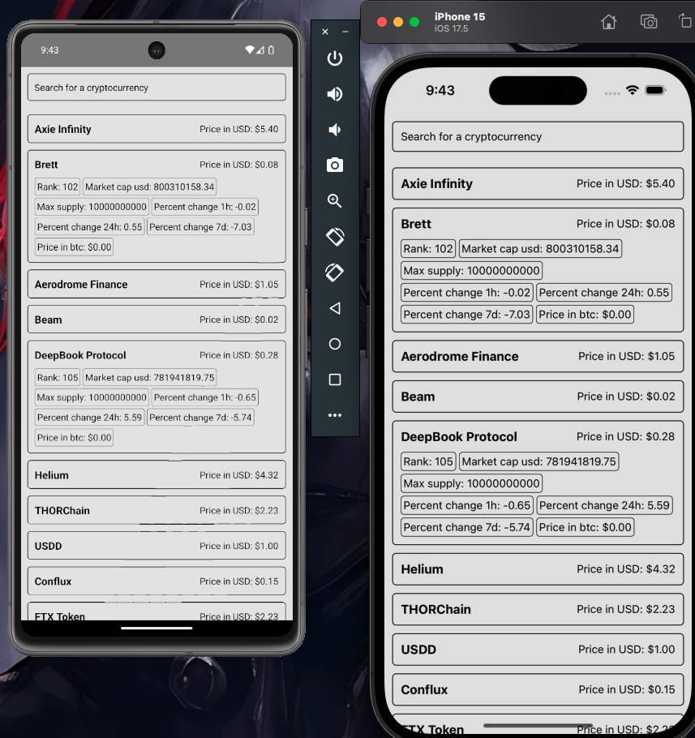

## 📋 Requisitos para ejecutar el proyecto

Para ejecutar este proyecto en dispositivos Android e iOS, asegúrate de contar con las siguientes herramientas instaladas en tu sistema.

---

## ✅ **Requisitos Generales**
- Node.js (`>= 18.x`)
- npm (`>= 9.x`) o Yarn (`>= 1.22.x`)
- Git (`>= 2.x`)
- Watchman (`>= 2023.x`)

---

## 📱 **Requisitos para Android**
- Java Development Kit (JDK) 17 o superior.
- Android Studio (`>= Flamingo | 2022.2.1`)
- Android SDK (`>= 33`)
- Android NDK (`>= 23.1.7779620`)
- Android Emulator o un dispositivo físico con **Depuración USB activada**.
- Variables de entorno configuradas:
  - `ANDROID_HOME`
  - `sdk.dir` en `android/local.properties`

---

---

## ‼️ **Si el proyecto no ejecuta correctamente**
- Favor confirmar y verificar las instalaciones de los requerimientos anteriormente mencionados.
- El proyecto funciona correctamiento con los requerimientos anteriormente mencionados en ambas plataformas.


---

## 🍏 **Requisitos para iOS** (solo en macOS)
- macOS (`>= Ventura 13`)
- Xcode (`>= 15`)
- CocoaPods (`>= 1.12.0`)
- Command Line Tools (`xcode-select --install`)
- Dispositivo físico o **iOS Simulator**.

---

## 🛠 **Pasos para ejecutar el proyecto**

### **1️⃣ Clonar el repositorio**
```bash
npm install
```

### **2️⃣ Ejecutar la aplicación**
#### **📱 Android**
```bash
npm run android
```

#### **🍏 iOS (Solo en macOS)**
```bash
npm run ios
```

#### **🚀 Después de buildear (si aplica)**
```bash
npm start
npm start --reset-cache # En caso de que se necesite resetear caché
```

#### **🧪 Para ejecutar los tests unitarios**
```bash
npm run test
```
